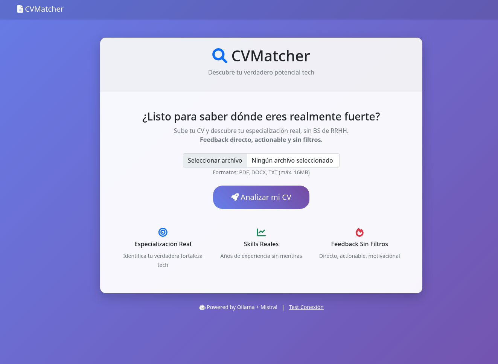
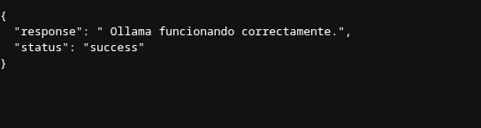
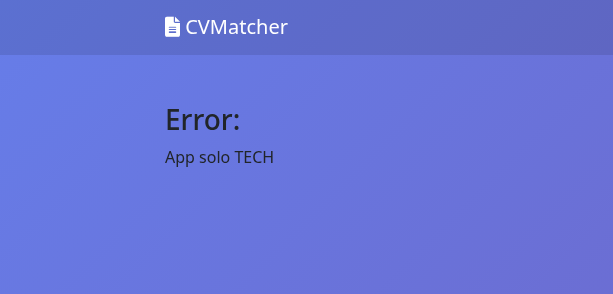
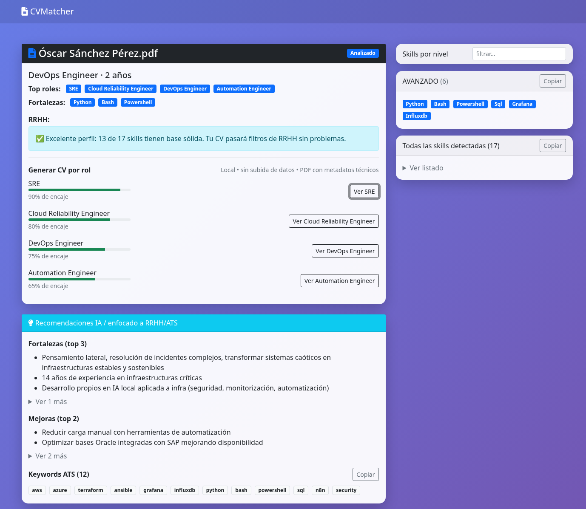
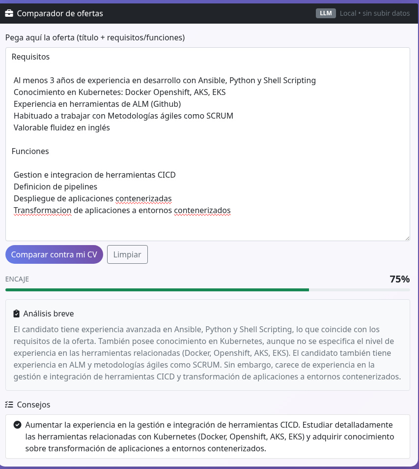
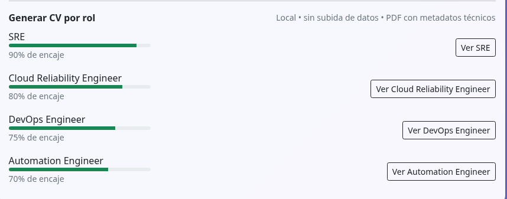
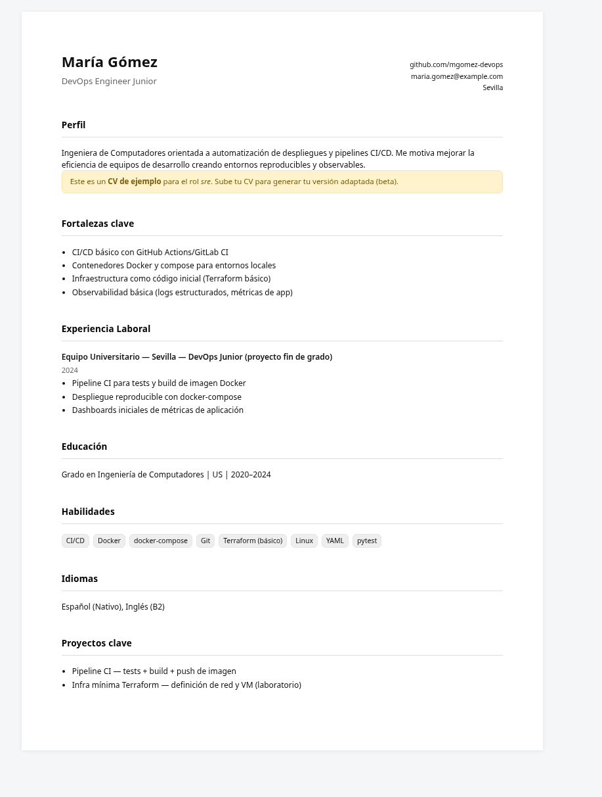

# CVMATCHER — IA local para auditar tu CV contra ofertas reales

> Descubre tu encaje real para roles tech. 100% local, sin nube, sin humo.



<p align="left">
  <a href="https://img.shields.io/badge/python-3.10%2B-blue">  </a>
  <a href="https://img.shields.io/badge/LLM-Ollama%20%7C%20Mistral-informational">  </a>
  <a href="https://img.shields.io/badge/Local-First-success">  </a>
  <a href="#releases">  </a>
</p>

---

## TL;DR

* Funciona **100% en local** con **Ollama** (probado con *mistral*).
* Sube tu CV (PDF/DOCX/TXT), analiza y te da **roles afines, fortalezas, gaps y keywords ATS**.
* **Corta** si el CV **no es tech** → no malgasta CPU ni tiempo.
* **Promedio** por CV: **\~22–25s**.

---

## Índice

* [¿Por qué CVMATCHER?](#por-qué-cvmatcher)
* [Características](#características)
* [Requisitos](#requisitos)
* [Instalación](#instalación)
* [Inicio rápido](#inicio-rápido)
* [Uso](#uso)
* [Demostraciones](#demostraciones)
* [Rendimiento](#rendimiento)
* [Privacidad](#privacidad)
* [Configuración avanzada](#configuración-avanzada)
* [Roadmap](#roadmap)
* [Contribuir](#contribuir)
* [FAQ](#faq)

---

## ¿Por qué CVMATCHER?

La mayoría de proyectos similares son SaaS, suben tus datos a la nube o te venden humo de ATS. **CVMATCHER** va directo al grano:

* **Local-first**: tus CVs **no salen** de tu equipo.
* **Feedback sin filtros**: si no hay evidencia técnica suficiente, lo dice.
* **Productividad real**: orienta acciones (qué añadir, qué quitar, cómo priorizar).

## Características

* **Detección de roles** afines (p. ej., SRE, Platform/DevOps, Cloud Reliability, Automation…).
* **Fortalezas, carencias y recomendaciones** claras para RRHH/ATS.
* **Keywords ATS** extraídas y agrupadas.
* **Comparador de ofertas**: pega una JD y calcula **encaje** con tu CV.
* **Generación de CV base por rol** *(beta)*.
* **Short-circuit no-tech**: si el CV no es tech, devuelve error y **no procesa**.
* **100% local** con **Ollama** + modelos abiertos (Mistral, LLaMA, etc.).

## Requisitos

* **Python 3.10+**
* **Ollama** en ejecución: `ollama serve`
* Modelo LLM (ejemplo): `ollama pull mistral`

## Instalación

```bash
git clone https://github.com/oscaar90/cvmatcher-local.git
cd cvmatcher-local
python3 -m venv venv
source venv/bin/activate  # Windows: venv\Scripts\activate
pip install -r requirements.txt
```

## Inicio rápido

1. Arranca Ollama y baja un modelo ligero:

   ```bash
   ollama serve &
   ollama pull mistral
   ```
2. Lanza la app web:

   ```bash
   python3 cvmetrics.py
   ```
3. Abre `http://127.0.0.1:5000` y sube tu CV.

## Uso

* **Entrada**: PDF, DOCX o TXT (≤16MB).
* **Salida**:

  * **Top roles** y **porcentaje de encaje**.
  * **Fortalezas** y **gaps** priorizados (con foco RRHH/ATS).
  * **Skills** detectadas por nivel + **keywords ATS**.
  * **Comparador** CV ↔ oferta (pega requisitos/funciones).
  * **CV base por rol** *(beta)*.

## Demostraciones
* Test de conexión con Ollama →
   
* Rechazo no-tech →
 
* CV DevOps con roles/gaps →
  
* Comparador de ofertas →
 
* Roles por encaje →
 
* **CV base (beta)** →
 

## Rendimiento

* **Tiempo medio por CV**: **22–25s** (antes 80–300s).
* **Short-circuit** para CVs **no tech**: evita gasto de CPU/GPU.

## Privacidad

* **No nube. No telemetría. No rastreo.**
* Los archivos se **procesan en local** y se **eliminan** tras el análisis.

## Configuración avanzada

* **Modelo**: define `OLLAMA_MODEL` (ej. `mistral`, `llama3:8b`)
* **Idioma UI**: ES por defecto.
* **Límites**: ajusta tokens/temperatura del modelo en el código si lo necesitas.

> Nota: no se generan CVs irreales. Si no hay **evidencia técnica**, se avisa y **no** se inventa nada.

## Roadmap

* Exportar reportes en **PDF/Markdown**.
* UI/UX mejorada (filtros, accesos rápidos, temas).
* Detección afinada para **AI/Platform Engineer**.
* Selección dinámica de modelo en UI.

## Contribuir

Las **PRs** son bienvenidas. Si encuentras un bug, abre un **issue** y (si puedes) adjunta un **CV de prueba anonimizado**.

### Guías rápidas

* Estilo: directo, sin adornos.
* Mantén el **local-first** como principio de diseño.
* Añade tests simples para parsers y prompts.

## FAQ

**¿Funciona offline?** Sí.

**¿Soporta otros modelos?** Sí, cualquier modelo que tengas en **Ollama** (ajusta `OLLAMA_MODEL`).

**¿Reescribe mi CV?** No. Genera un **CV base por rol** (beta) y te da guía, pero **no inventa experiencia**.

**¿Qué formatos acepta?** PDF, DOCX, TXT.

**¿Por qué a veces me dice “App solo TECH”?** Porque tu CV no muestra evidencias técnicas suficientes; está diseñado para **no perder tiempo** ni engañarte.

---

<p align="center">
Hecho con 💻⚙️ por gente que **prefiere lo local** a las diapositivas de humo.
</p>

