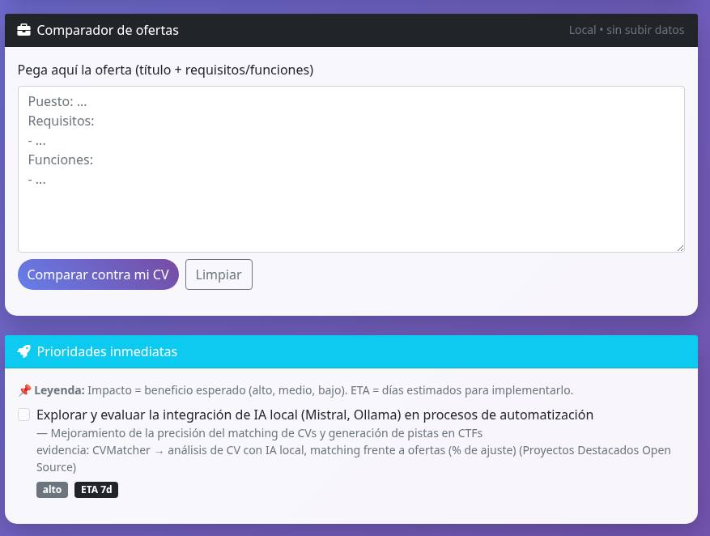

# CVMatcher Local

Analiza tu CV frente a ofertas reales usando **IA local**, sin depender de OpenAI ni enviar tus datos fuera.  
Funciona 100% en local con **Ollama** y modelos ligeros como Mistral o LLaMA.  

---

## 🚀 Características
CVMATCHER V2

CVMATCHER V2 es una aplicación local que analiza CVs (PDF, DOCX, TXT) y los contrasta con roles profesionales del sector tecnológico.
El objetivo es detectar fortalezas reales, carencias y dar feedback claro sobre el encaje de un CV con diferentes posiciones.

🚀 Instalación

Clona el repositorio:

```bash
git clone https://github.com/oscaar90/cvmatcher-local.git
cd cvmatcher-local
```

Crea un entorno virtual:

```bash
python3 -m venv venv
source venv/bin/activate
```

Instala dependencias:

```bash
pip install -r requirements.txt
```

Asegúrate de tener Ollama instalado y corriendo en tu equipo local:

```bash
ollama serve
ollama pull mistral
```

⚙️ Ejecución

Inicia la aplicación web:

```bash
python3 cvmetrics.py
```

Salida esperada:

🚀 Iniciando CVMatcher...
📊 Asegúrate de tener Ollama ejecutándose: ollama serve
🤖 Modelo requerido: ollama pull mistral
 * Running on http://127.0.0.1:5000


Abre en tu navegador:
http://127.0.0.1:5000

🖥️ Uso

Carga tu CV en PDF, DOCX o TXT (máx. 16 MB).

La app analiza el documento y muestra:


Roles más vinculados.

Roles más vinculados. Además la app permite generar un CV base adaptado a cada rol.

Fortalezas y mejoras.

Skills detectadas con nivel.

Keywords ATS extraídas.

Recomendaciones frente a procesos de selección.

Opcional: compara tu CV contra una oferta pegando los requisitos para ver el encaje.

## 📸 Capturas  

### Pantalla principal  
  

### Test de conexión con Ollama  
  

### CV no relacionado con tecnología  
  

### CV con perfil DevOps válido  
  
  
### Comparador de ofertas  
  

### Roles
  

### Generar CV Base
  


Comparador de ofertas

🧪 Ejemplos de salida
Caso 1 – CV no tech

El sistema corta el proceso y devuelve:

```javascript
Error:
App solo TECH
```

Caso 2 – CV DevOps válido

Roles detectados: SRE, Cloud Reliability Engineer, DevOps Engineer, Automation Engineer.

Skills sólidas: Python, Bash, Powershell, SQL, Grafana, InfluxDB.

Recomendaciones claras para mejorar CV y keywords ATS extraídas.

📊 Métricas de rendimiento

Procesamiento medio por CV: 22–25 segundos (antes 80–300).

Si detecta que no es un perfil tech, corta el análisis y no consume recursos innecesarios.

🔒 Privacidad

100% local.

No se suben datos a ningún servidor externo.

Los archivos se eliminan tras el análisis.

🛠️ Roadmap

Exportar reportes en PDF y Markdown.

Interfaz web más avanzada.

Ajustar detección para roles emergentes (AI Engineer, Platform Engineer, etc.).

🤝 Contribuciones

Pull requests y mejoras son bienvenidas.
Si encuentras un bug, abre un issue y, si lo deseas, adjunta un CV de prueba anonimizado.

💡 Nota: CVMATCHER no reescribe tu CV. Te muestra lo que realmente transmite frente a procesos de selección y si encaja con los roles a los que aplicas.
- Extracción de skills y experiencia desde tu CV (PDF/DOCX).
- Comparación contra descripciones de ofertas de empleo.
- Detección automática de dominio técnico (**tech** vs **non-tech**).
- Guardrails:
  - Si el CV no aporta skills → **rechazo directo** con mensaje sarcástico.
  - No se generan CVs falsos si no hay evidencia técnica.
- Generación de informes en **PDF/HTML** con el detalle de encaje.
- Ejecución **local** y privada (sin nube).

---

## 📂 Estructura del repo

cvmetrics.py → núcleo de la app (análisis y métricas)
skills_catalog.py → catálogo de skills y alias normalizados
requirements.txt → dependencias
cv_examples/ → CVs de ejemplo para probar
templates/ → plantillas para reportes


---

## ⚙️ Requisitos

- Python 3.10+
- [Ollama](https://ollama.ai) instalado y corriendo localmente
- Paquetes Python:

  pip install -r requirements.txt
▶️ Uso
Clonar el repo:


git clone https://github.com/oscaar90/cvmatcher-local.git
cd cvmatcher-local
Ejecutar el análisis sobre un CV:

Ver resultados en consola o exportar a PDF/HTML.

🧩 Roadmap
 V2: Guardrail para CVs vacíos (0 skills).

 HARSH_MODE: mensajes directos cuando el CV es genérico.

 Añadir soporte para más idiomas (EN/FR).

 Interfaz web simple en Flask.

📜 Licencia
MIT — libre para usar, modificar y compartir.
